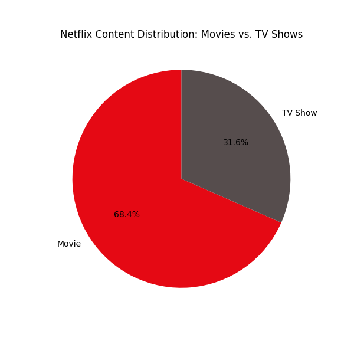
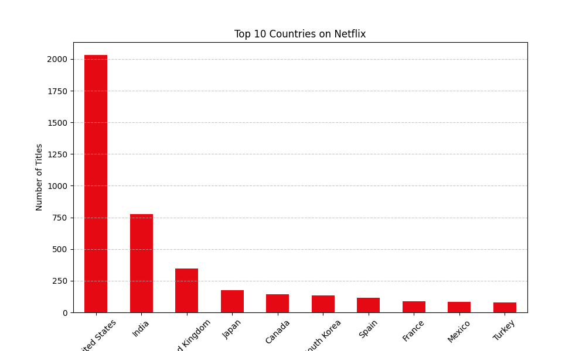

# 🎬 Netflix Data Analysis

**Author:** Nabeel Tawabini  
**Tech Stack:** Python, Pandas, Matplotlib

## 📌 Project Overview
An Exploratory Data Analysis (EDA) on Netflix's dataset to understand content trends. This project analyzes the distribution of movies vs. TV shows and identifies the top content-producing countries.

---

## 📊 Key Insights & Visualizations

### 1. Movies vs. TV Shows Dominance
Does Netflix focus more on Movies or TV Shows?


> **Insight:** As shown above, Movies dominate the platform content compared to TV Shows.

---

### 2. Top Content Producing Countries
Which countries are the biggest contributors to Netflix?


> **Insight:** The United States is the leading producer, followed significantly by India and the UK.

---

## 🛠️ How to Run
1. Clone the repository:
   ```bash
   git clone [https://github.com/nabeeltawabini/Netflix-Data-Analysis.git](https://github.com/nabeeltawabini/Netflix-Data-Analysis.git)